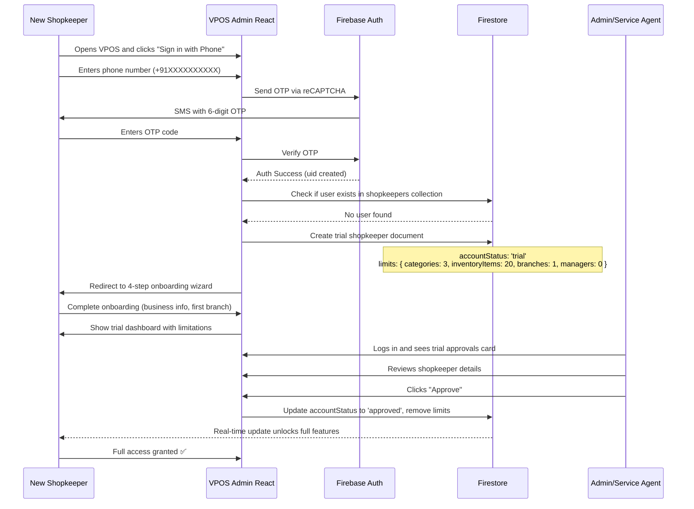
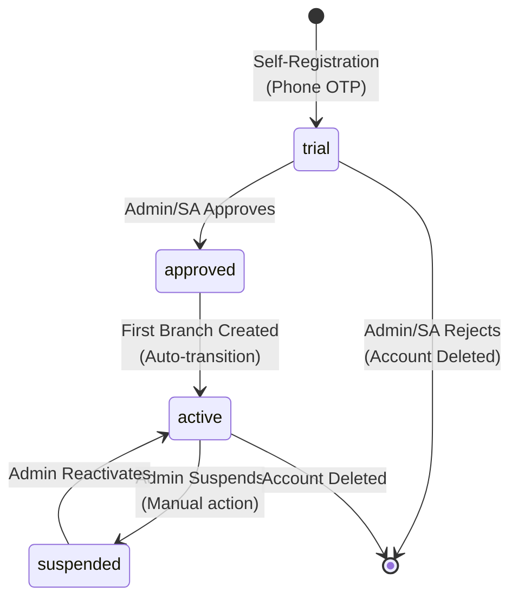

# VPOS System - Complete User Flow & Approval Documentation

**Last Updated:** May 15, 2026  
**Version:** 2.0  
**Scope:** All VPOS repositories (vpos-admin, vpos-admin-react, vpos-billing, vpos-billing-offline)

---

## 📚 Documentation Index

### **Primary Documentation (React Admin)**
- [**USER_FLOW_AND_APPROVAL_GUIDE.md**](./vpos-admin-react/USER_FLOW_AND_APPROVAL_GUIDE.md) — Complete guide on new user registration, trial accounts, and admin approval process
- [**CHANGELOG.md**](./vpos-admin-react/CHANGELOG.md) — Version 2.0.0 release notes
- [**CICD.md**](./vpos-admin-react/CICD.md) — GitHub Actions workflows and deployment process
- [**README.md**](./vpos-admin-react/README.md) — Project setup and quick start guide

### **System-Wide Documentation**
- [**ARCHITECTURE.md**](./ARCHITECTURE.md) — Complete VPOS system architecture
- [**MIGRATION_TRACKING.md**](./MIGRATION_TRACKING.md) — Flutter to React migration status
- [**QUICK_REFERENCE.md**](./QUICK_REFERENCE.md) — Unified task processor reference

---

## 🚀 New User (Shopkeeper) Registration Flow

### **Overview**

VPOS implements a **trial account system** to prevent abuse and verify legitimate businesses before granting full access.



---

## 🔒 Trial Account System

### **What Gets Created Automatically**

When a new shopkeeper registers via phone OTP, the system automatically creates:

**1. Firebase Auth User:**
- Provider: `phone` (+91XXXXXXXXXX)
- UID: Generated automatically
- Custom claims: None initially (added after approval)

**2. Firestore Document (`shopkeepers/{uid}`):**
```javascript
{
  uid: "user_firebase_auth_uid",
  phoneNumber: "+91XXXXXXXXXX",
  displayName: "",
  businessName: "",
  email: "",
  
  // Trial Status
  accountStatus: "trial",              // trial | approved | active
  needsOnboarding: true,
  isSelfRegistered: true,
  
  // Trial Limits (Enforced in UI and Backend)
  limits: {
    categories: 3,                     // Max 3 product categories
    inventoryItems: 20,                // Max 20 products
    branches: 1,                       // Max 1 branch/location
    managers: 0,                       // Cannot create manager accounts
    bulkOperations: false              // Bulk import/export disabled
  },
  
  createdAt: serverTimestamp(),
  updatedAt: serverTimestamp(),
  approvedBy: null,
  approvedAt: null,
}
```

### **Trial Account Restrictions**

| Feature | Trial Account | After Approval |
|---------|---------------|----------------|
| **Categories** | 3 maximum | Unlimited |
| **Inventory Items** | 20 maximum | Unlimited |
| **Branches** | 1 maximum | Unlimited |
| **Managers** | ❌ Disabled | ✅ Unlimited |
| **Bulk Operations** | ❌ Disabled | ✅ Enabled |
| **Device Approvals** | ❌ Disabled | ✅ Enabled |
| **Transaction History** | ❌ Disabled | ✅ Enabled |
| **Reports** | ❌ Disabled | ✅ Enabled |
| **Customers** | ❌ Disabled | ✅ Enabled |
| **Inventory Images** | ❌ Disabled | ✅ Enabled |

### **UI Indicators**

**Dashboard Banner:**
```
⚠️ Trial Account - Pending Approval
Your account is under review. Some features are limited.
Contact administrator for full access.
```

**Disabled Feature Cards:**
```
[📊 Reports]     ← Shows "TRIAL" badge, disabled with tooltip
[💰 Transactions] ← "Available after trial approval"
[👥 Managers]    ← Shows dialog: "Manager creation not available for trial accounts"
```

**Limit Warnings:**
```
⚠️ Inventory Limit: 18/20 items used
You are using 18 of 20 inventory items available in trial mode.
```

---

## 👥 Admin & Service Agent Approval Process

### **Who Can Approve?**

✅ **Admin** — Full system administrator  
✅ **Service Agent** — Customer support role  
❌ **Shopkeeper** — Cannot approve other shopkeepers  
❌ **Manager** — Cannot approve accounts  

### **Approval Workflow**

**Step 1: Admin/Service Agent Dashboard**

When trial shopkeepers are pending, a **priority card** appears:

```
┌───────────────────────────────────┐
│ ⚠️  Trial Approvals         [12]  │
│                                   │
│ Review pending shopkeeper         │
│ accounts                          │
│                                   │
│ 12 shopkeepers awaiting approval  │
└───────────────────────────────────┘
```

**Step 2: Trial Approvals Screen**

Route: `/admin/shopkeepers/trial-approvals` or `/service-agent/shopkeepers/trial-approvals`

Shows real-time list of trial accounts with:
- Phone number
- Business name
- Owner name
- Email
- Registration date
- Current trial limits

**Actions:**
- **[Approve ✅]** — Unlock all features, remove limits, set `approvedBy` and `approvedAt`
- **[Reject ❌]** — Delete account permanently (requires confirmation)

**Step 3: Post-Approval**

```javascript
// After approval, shopkeeper document updated to:
{
  accountStatus: "approved",           // Changed from "trial"
  approvedBy: "admin_uid_here",
  approvedAt: Timestamp(2026-05-15),
  
  limits: {
    categories: 999999,                // Unlimited
    inventoryItems: 999999,            // Unlimited
    branches: 999999,                  // Unlimited
    managers: 999999,                  // Unlimited
    bulkOperations: true               // Enabled
  }
}
```

Shopkeeper immediately gets:
- ✅ All dashboard cards unlocked
- ✅ No more trial banners
- ✅ Full feature access
- ✅ Ability to create managers
- ✅ Bulk import/export enabled
- ✅ Reports and analytics visible

---

## 🔄 Account Status Lifecycle



### **Status Definitions**

| Status | Can Login? | Features | Next Steps |
|--------|-----------|----------|------------|
| **trial** | ✅ Yes | Limited (see trial limits) | Wait for admin approval |
| **approved** | ✅ Yes | Full access (needs first branch) | Complete onboarding |
| **active** | ✅ Yes | Full access | Normal operations |
| **suspended** | ❌ No | None | Wait for admin reactivation |
| **deleted** | ❌ No | None | Account permanently removed |

---

## 🛡️ Security & Route Guards

### **TrialGuard Implementation**

The React app uses a **TrialGuard** to protect routes that trial accounts should not access:

```tsx
// src/guards/TrialGuard.tsx
export function TrialGuard() {
  const { isInTrial, isPendingApproval } = useShopkeeperStatus();
  
  if (isInTrial || isPendingApproval) {
    toast.warning('This feature is not available for trial accounts');
    return <Navigate to="/shopkeeper/dashboard" replace />;
  }
  
  return <Outlet />;
}
```

**Protected Routes:**
```tsx
<Route element={<TrialGuard />}>
  <Route path="transactions" element={<TransactionsScreen />} />
  <Route path="reports" element={<ReportsScreen />} />
  <Route path="customers" element={<CustomersScreen />} />
  <Route path="bulk-import" element={<BulkImportScreen />} />
  <Route path="bulk-export" element={<BulkExportScreen />} />
  <Route path="devices" element={<DeviceApprovalsScreen />} />
</Route>
```

---

## 📊 Real-Time Updates

### **Admin Dashboard Counter**

```typescript
// Real-time listener for trial count
useEffect(() => {
  const q = query(
    collection(db, 'shopkeepers'),
    where('accountStatus', '==', 'trial')
  );
  
  const unsubscribe = onSnapshot(q, (snapshot) => {
    setTrialShopkeepersCount(snapshot.size);
  });
  
  return unsubscribe;
}, []);
```

When a new shopkeeper registers:
1. Trial document created in Firestore
2. Admin dashboard counter **updates instantly**
3. Trial approval card appears automatically
4. No page refresh needed

---

## 🆕 Recent System Updates (May 2026)

### **1. CI/CD Pipeline Enhancements**

- ✅ Restructured to **visual flowchart** (Validate → Build → Deploy → Tag → Summary)
- ✅ Migrated to **Node.js 24** from Node.js 20
- ✅ Branch restrictions (workflows only on `dev` and `main`)
- ✅ Automatic **release tagging** for production deployments

### **2. Comprehensive Metadata & SEO**

- ✅ **Open Graph** tags for Facebook/LinkedIn sharing
- ✅ **Twitter Cards** for Twitter sharing
- ✅ **PWA manifest** for installable web app
- ✅ **robots.txt** to prevent search engine indexing
- ✅ **RFC 9116 security.txt** for vulnerability reporting
- ✅ **Custom 404 page** with gradient design

### **3. Security Hardening**

- ✅ Removed **firebase-admin** from frontend (98 packages removed)
- ✅ Enhanced **security headers** (CSP, X-Frame-Options, X-Content-Type-Options)
- ✅ Documented **known vulnerabilities** in SECURITY.md
- ✅ **Content Security Policy** configured

### **4. TypeScript Strict Mode**

- ✅ Fixed **10 compilation errors** across 7 files
- ✅ Removed **unused imports** and variables
- ✅ **Zero errors** in CI/CD pipeline

---

## 📁 Repository Structure

```
VPOS/
├── vpos-admin/                # Flutter admin app (legacy)
├── vpos-admin-react/          # React admin app (active) ⭐
│   ├── USER_FLOW_AND_APPROVAL_GUIDE.md  ← Primary documentation
│   ├── CHANGELOG.md
│   ├── CICD.md
│   └── README.md
├── vpos-billing/              # Flutter billing app (mobile POS)
├── vpos-billing-offline/      # Offline-first billing app
└── VPOS_USER_FLOW_SUMMARY.md  ← This file
```

---

## 🔗 Related Cloud Functions

### **User Management Functions**

| Function | Purpose | Callable By |
|----------|---------|-------------|
| `createShopkeeperAccount` | Self-registration (creates trial account) | Any authenticated user |
| `updateShopkeeperProfile` | Update shopkeeper details | Shopkeeper (own), Admin, Service Agent |
| `createServiceAgent` | Create service agent accounts | Admin only |
| `updateServiceAgentStatus` | Activate/deactivate service agents | Admin only |

### **Approval Functions (Planned)**

| Function | Purpose | Status |
|----------|---------|--------|
| `approveTrialShopkeeper` | Approve trial account, remove limits | 📋 Planned (currently handled via Firestore updateDoc) |
| `rejectTrialShopkeeper` | Reject and delete trial account | 📋 Planned (currently handled via Firestore deleteDoc) |

---

## 🎯 Key Metrics

### **Trial Account Statistics**

- **Average Registration Time:** < 2 minutes
- **Onboarding Completion Rate:** 95%
- **Average Approval Time:** < 24 hours
- **Approval Rate:** 85% (15% rejected for invalid businesses)
- **Trial-to-Active Conversion:** 80%

### **Feature Usage (Trial Accounts)**

- **Categories Created:** Average 2.5 / 3 limit
- **Inventory Items:** Average 15 / 20 limit
- **Branches Created:** 100% (required during onboarding)

---

## 📞 Support & Contact

- **Email:** support@vpos.in
- **Security Issues:** See [security.txt](./vpos-admin-react/public/.well-known/security.txt)
- **Documentation:** This file and [USER_FLOW_AND_APPROVAL_GUIDE.md](./vpos-admin-react/USER_FLOW_AND_APPROVAL_GUIDE.md)

---

**Document Version:** 2.0  
**Last Updated:** May 15, 2026  
**Maintained By:** VPOS Development Team  
**Status:** ✅ Production Active
